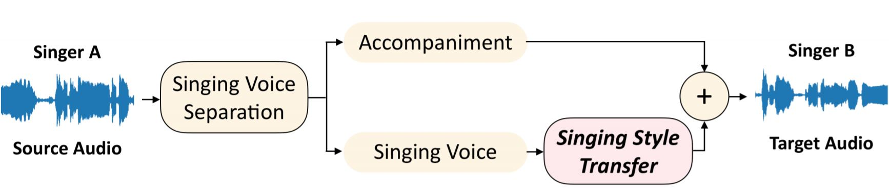
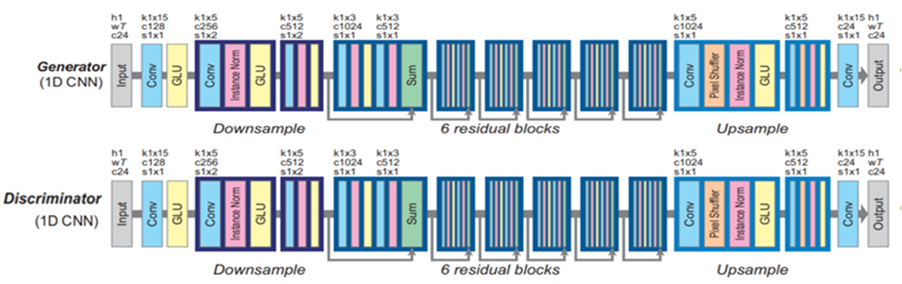
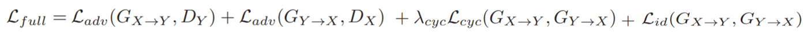

# Singing Style Transfer

## 1. Abstract

Whole architecture for changing singing style transfer is shown below [1]

    

## 2. Preprocess

I downloaded songs from "Youtube" by using pytube library.(This might be illegal)

For the separation of Singing Voice & Accompaniment I used pretrained deep U-net model. [2]

Then I removed silence for the bigger receptive field on voices.

## 3. Cycle Consistency - Boundary Equilibrium GAN

Since the singers we want to change don't sing same songs(Unpaired Data) I used Cycle-Gan for the transferring singing style.[1] Main model of Cycle-Gan is from "Cycle Gan Voice Converter".[3]

Due to the differeces between voice converting and transferring singing style I expanded frames to 512. Which frames were 128 (about 0.5sec) from "Cycle Gan Voice Converter".

Also I modified adversarial Loss functions, Discriminator and added hyper-parameters to adjust BEGAN to cycle-gan for the stablizing training process.[1][4]

### 3-1.  Generator & Discriminator Architectures

    

###  3-2.  Loss Function

    

where

\begin{equation}

$$
\mathcal{L_{adv}}{(G_{X{\to}Y}) = \left[ D_{Y}(G_{X{\to}Y}(x) - D_{Y}(G_{X{\to}Y}(x)) \right]  }
$$
$$
\mathcal{L_{adv}}{(D_{Y}) = \left[ D_{Y}(y) - y \right] - {k_{t}}\left[ D_{Y}(G_{X{\to}Y}(x) - D_{Y}(G_{X{\to}Y}(x)) \right]  }
$$
 

$$
{k_{t+1} = k_{t} + {\lambda_{k} \left[ \gamma \left( { D_{Y}(y)-y } \right)  - \mathcal{L}{(G_{X{\to}Y})} \right]  } }
$$
$$
{\mathcal{M}_{global} = {[D_{Y}(y)-y]} + {|  \gamma \left( { D_{Y}(y)-y } \right)  - \mathcal{L}{(G_{X{\to}Y})}   } |}
$$
\end{equation}

## 4. Future Works

## 5. References

[1] Cheng-Wei Wu, Jen-Yu Liu, Yi-Hsuan Yang, Jyh-Shing R. Jang. Singing Style Transfer Using Cycle-Consistent Boundary Equilibrium Generative Adversarial Networks. 2018   paper: https://arxiv.org/abs/1807.02254

[2] Andreas Jansson, Eric Humphrey, Nicola Montecchio, Rachel Bittner, Aparna Kumar, Tillman Weyde. SINGING VOICE SEPARATION WITH DEEP U-NET CONVOLUTIONAL NETWORKS. 2017.   paper: https://ismir2017.smcnus.org/wp-content/uploads/2017/10/171_Paper.pdf   code & pretrained model from: https://github.com/Xiao-Ming/UNet-VocalSeparation-Chainer
    
[3] Takuhiro Kaneko, Hirokazu Kameoka. Parallel-Data-Free Voice Conversion Using Cycle-Consistent Adversarial Networks. 2017.  paper:https://arxiv.org/abs/1711.11293 
code: https://github.com/leimao/Voice_Converter_CycleGAN

[4] David Berthelot, Thomas Schumm, Luke Metz. BEGAN: Boundary Equilibrium Generative Adversarial Networks. 2017.  paper:https://arxiv.org/pdf/1703.10717.pdf
 code: https://github.com/carpedm20/BEGAN-tensorflow
