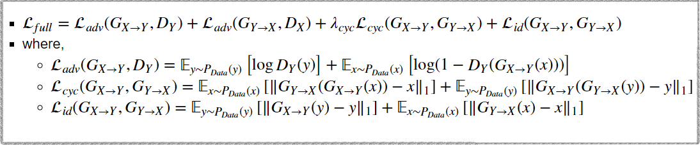
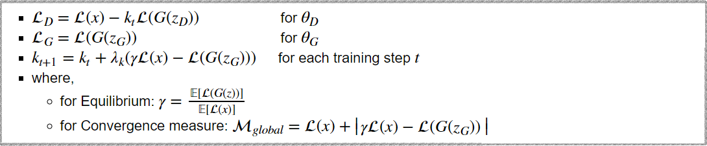

# Singing Style Transfer

- My contribution on Team Project on Eliceio team4: vocal-style-transfer (https://github.com/eliceio/vocal-style-transfer)

- I was in charge of transfering singing style by using separated vocal data(separated by pretrained Deep U net[2]) not by clean speech data. And I adapted BE-GAN[4] training skill to Cycle-GAN-VC[3] refer to Singing Style Transfer C-BEGAN [1].

## 1. Abstract

- Whole architecture for changing singing style transfer is shown below [1]

## 2. Preprocess

- First download songs from "Youtube" by using pytube library.(This might be illegal) For the vocal data I downloaded Park Hyo Shin and BolBBalGan Sachungi's songs. (about 15 songs each)
    - [running ex](https://github.com/NamSahng/SingingStyleTransfer/blob/master/Preprocess/Data_Download_from_YT.ipynb)

- For the separation of Singing Voice & Accompaniment I used pretrained deep U-net model. [2]
    - [running ex](https://github.com/NamSahng/SingingStyleTransfer/blob/master/Preprocess/Unet_vocalseparation/run_separation.ipynb)

- Finally, use pydub library to remove silence on singing vocal data.
    - [running ex](https://github.com/NamSahng/SingingStyleTransfer/blob/master/Preprocess/Silence_Removal.ipynb)

## 3. Cycle Consistency - Boundary Equilibrium GAN

- Vocal Representation
    - Datas were downsampled to 16 kHz. For the separation normalized magnitude spectrogram were used and for the transfer  24 Mel-cepstral coefficients (MCEPs) were used.[2][3]

- Since the singers we want to change don't sing same songs(Unpaired Data) I used Cycle-GAN for the transferring singing style.[1] Main model of Cycle-GAN is from "Cycle GAN Voice Converter".[3]

- Cycle GAN Voice Converter: Gated CNN and Identyty-mapping loss was the main modification from the Original CycleGAN architecture.
    - a. Gated CNN: [Gated CNN paper](https://arxiv.org/abs/1612.08083)
        - Since RNN is computationally demanding due to the difficlty of parallel implementations, Cycle GAN VC used Gated CNN which not only allows parallelization over sequential data but also achieves state-ofthe-art in language modeling and speech modeling.
        - In a gated CNN, gated linear units (GLUs) are used as an activation function where GLU is a is a data-driven activation function. (Orgiinal Cycle Gan used ReLU for generator and Leaky ReLU for Discriminator.)
        - $ H_{l+1} = (H * W_{l} + b_{l}) \otimes \sigma(H_{l} *  V_{l} + c_{l}) $
        - [short explanation about Gated CNN in korean](https://github.com/NamSahng/Summary/blob/master/NLP%26DL_CKH/5.%20Neural%20Language%20Models%20-%20part2.ipynb)
    - b. Identity-Mapping Loss: [Identity Loss paper](https://arxiv.org/pdf/1611.02200.pdf)
        - To encourage linguistic-information preservation without relying on extra modules, Cycle GAN VC incorporate an identitymapping loss which encourages the  generator to find the mapping that preserves composition between the input and output.
        - The original study on CycleGAN showed the effectiveness of this loss for color preservation.
        - [Identity Loss short explanation on youtube](https://www.youtube.com/watch?v=Fkqf3dS9Cqw&t=2309s)
            - 36min ~ 39min
    - You could find more details about Cycle GAN Voice Converter on original paper[3]

- Modification on Cycle GAN Voice Converter:
    - I modified Discriminator Architecture, Adversarial Loss function and added hyper-parameters to adapt BEGAN training skill to Cycle GAN Voice Converter to stablize training process. [1][4]
    
    - Also, Due to the differeces between converting voices and converting singing style I expanded frames to 512. Which frames were 128 (about 0.5sec) from "Cycle Gan Voice Converter".
  
    

### 3-1.  Generator & Discriminator Architectures

- Original Architectures (Cycle GAN Voice Converter[3]) : [code](https://github.com/leimao/Voice_Converter_CycleGAN/blob/master/model.py)
    - 

- BEGAN Architectures[4]: [code](https://github.com/carpedm20/BEGAN-tensorflow/blob/master/models.py)
    - 

- Modified Architectures: [code](https://github.com/NamSahng/SingingStyleTransfer/blob/master/CycleConsistency-BoundaryEquilibrium-GAN/module.py)
    - 

###  3-2.  Loss Function

- Original Loss function (Cycle GAN Voice Converter[3]): [code](https://github.com/leimao/Voice_Converter_CycleGAN/blob/master/model.py) 

        

- BEGAN Loss function [4]: [code](https://github.com/carpedm20/BEGAN-tensorflow/blob/master/trainer.py)

- Modified Loss function (Cycle Consistency Boundary Equilibrium GAN): [code](https://github.com/NamSahng/SingingStyleTransfer/blob/master/CycleConsistency-BoundaryEquilibrium-GAN/model.py)

## 4. Future Works

- More powerful separation for vocal separation.

- Embed more information such as lyrics and use Tacotron as a Generator.(maybe?) ex) Tacotron GAN "https://github.com/tmulc18/S2SCycleGAN"

## 5. References

[1] Cheng-Wei Wu, Jen-Yu Liu, Yi-Hsuan Yang, Jyh-Shing R. Jang. Singing Style Transfer Using Cycle-Consistent Boundary Equilibrium Generative Adversarial Networks. 2018   paper: https://arxiv.org/abs/1807.02254

[2] Andreas Jansson, Eric Humphrey, Nicola Montecchio, Rachel Bittner, Aparna Kumar, Tillman Weyde. SINGING VOICE SEPARATION WITH DEEP U-NET CONVOLUTIONAL NETWORKS. 2017.   paper: https://ismir2017.smcnus.org/wp-content/uploads/2017/10/171_Paper.pdf   code & pretrained model from: https://github.com/Xiao-Ming/UNet-VocalSeparation-Chainer
    
[3] Takuhiro Kaneko, Hirokazu Kameoka. Parallel-Data-Free Voice Conversion Using Cycle-Consistent Adversarial Networks. 2017.  paper:https://arxiv.org/abs/1711.11293 
code: https://github.com/leimao/Voice_Converter_CycleGAN

[4] David Berthelot, Thomas Schumm, Luke Metz. BEGAN: Boundary Equilibrium Generative Adversarial Networks. 2017.  paper:https://arxiv.org/pdf/1703.10717.pdf
 code: https://github.com/carpedm20/BEGAN-tensorflow
